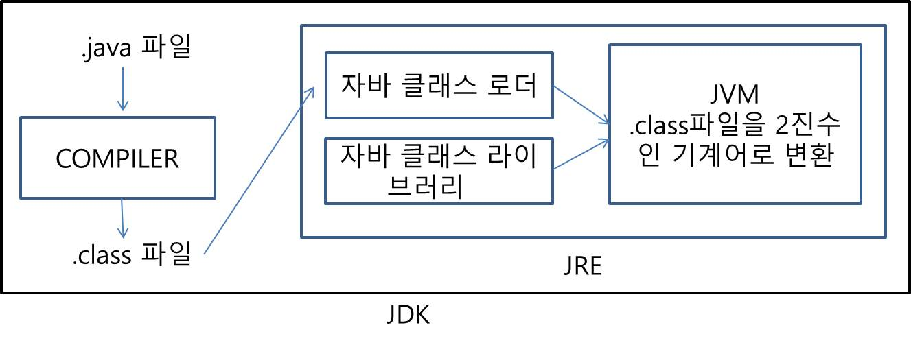

# 1. 프로그래밍 언어

- 컴퓨터는 기계어인 2진수로 동작함. (신호가 없을 때는 0, 신호가 있을 때는 1)
- 0과 1의 조합으로 된 2진수가 명령으로 입력되고, 컴퓨터는 입력된 2진수를 해석하여 실행됨.
- 2진수는 사람이 사용하기엔 복잡하고 코드가 길어짐.
- 프로그래밍 언어는 사람과 컴퓨터의 커뮤니케이션 역할.
- 프로그래밍 언어로 작성된 코드가 실행되면 2진수로 변환되어 컴퓨터에 명령을 전달함.

# 2. 프로그래밍 언어의 종류

- 저급 언어 : 기계어(2진수), 어셈블리어
- 고급 언어 : C, C++, Python, Java …
- 저급언어는 기계중심의 언어, 고급언어는 사람중심의 언어.
- 저급언어는 해석과정이 필요 X, 컴퓨터에서 직접 실행 가능.
- 고급언어는 기계어로 해석하는 과정 필요함. 해석하는 과정을 처리해주는 컴파일러, 인터프리터가 필요함.
- 저급언어는 하드웨어 지식이 필요한 반면, 고급언어는 하드웨어 지식보다는 언어의 문법이 중요함.

# 3. 어셈블리어(Assembly Language)

- 기계어와 1대1 매핑되는 저급 프로그래밍 언어
- 1949년 등장한 첫 프로그래밍 언어
- ex) 10110000 01100001 > mov al, 061h (16진수 61을 al(레지스터)로 이동시켜라)

# 4. Java

- 1995년 썬 마이크로 시스템즈에서 발표한 프로그래밍 언어
- Java는 JVM(Java Virtual Machine)이 자바프로그램을 기계어로 해석해서 동작시키는데, 어떤 os에서든 동일하게 동작
- ex) Windows에서 작성한 Java코드가 MacOS, 리눅스에서 동일하게 동작.
- C, C++는 os별 컴파일러가 달라서 따로 설정해야함. (Windows에서 작성한 C,C++ 코드를 리눅스에서 동작하기 위해 gcc 컴파일러를 별도로 설치해야됨)
- JVM 내에 존재하는 GC(Garbage Collector) : 장시간 사용되지 않은 변수, 클래스, 함수 등을 자동으로 메모리에서 제거.
- C, C++에선 malloc 명령어로 변수, 함수, 클래스를 메모리에 올리고 free라느 명령어로 메모리 해제 과정 필요
- 객체지향 언어(OOP-Object Oriented Programming) : 클래스(부품의 설계도)를 작성해 객체(부품)을 만들어서 부품들 간의 관계를 정의하고, 부품들 간의 연결을 생성하여 더 큰 프로그램을 완성하는 방식
- 오픈 소스 라이브러리들이 다른 언어에 비해 풍부해서, 다른 언어보다 개발기간이 짧음.

# 5. JDK

- JDK(Java Development Kit) : 자바 프로그램을 개발할 수 있는 환경을 제공하는 키트
- JDK에는 Java Compiler와 JRE(Java Runtime Environment)가 포함됨.
- Java Complier는 작성된 .java 파일을 컴파일하여 .class 파일로 변경함.
- .class파일은 16진수인 바이트코드로 구성됨. 따라서 컴퓨터가 바로 실행 불가.
- JRE에 존재하는 JVM이 .class파일을 다시 기계어로 해석해주고 컴퓨터에 명령을 보냄.

# 6. JRE

- JRE(Java runtime Environment) : 자바 프로그램을 실행할 수 있는 환경.
- 자바 클래스 라이브러리, JVM(Java Virtual Machine), 자바 클래스 로더(Java Class Loader)를 포함.
- 자바 클래스 라이브러리 : 자바 소스 코드를 작성할 때 자주 사용되는 라이브러리 클래스들의 집합
- java.lang 패키지 : String, Integer, Object 등의 클래스 제공
- java.util 패키지 : List, Map, Array 컬렉션 관련 클래스 제공
- 자바 클래스 로더 : .class 파일을 JVM에 올려주는 역할
- 
  .
