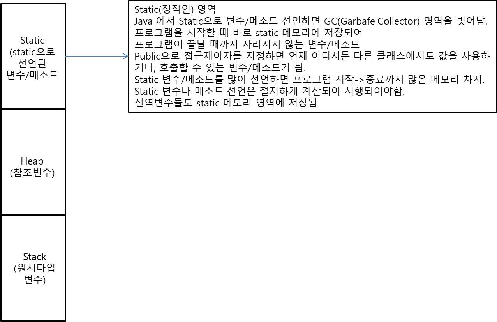

# 1. while

for문보다 간단하게 사용 가능한 반복문

- while(조건) {  
   //반복적으로 실행될 소스코드  
  }
- 조건이 true면 블록 안 소스코드를 반복실행  
  조건이 false일 경우 반복문 종료.  
  ex )

        int num = 1;
        int sum = 0;
        while(num <=10) {
            sum += num
        }

- for문과 다른 점 : 초기화식/증감식 사용 불가. 오직 조건식만 명시.

# 2. do~while

조건과 상관 없이 소스코드를 무조건 1회 실행 후, while문의 조건식을 검사 -> while의 조건이 true일 때 반복적으로 실행  
ex )

    int sum = 0;
    int num = 1;
    do {
        sum += num++;   //무조건 1회 실행 후 조건 true면 반복실행
    } while(num <=100)

# 3. 중첩 반복문

for문 내에 for문 다시 선언하여 반복.

    for() {
        for() {
        }
    }
    ---------------
    //2~9까지 8번 반복
    for(int i = 2; i <=9; i++) {
        //1~9까지 9번 반복
        //i=2일 때 9번(j=1~j=9) 반복
        //안쪽 for문이 종료되면 다시 바깥 for문으로 돌아가서 증감식 실행
        //i=3일 때 9번(j=1~j=9) 반복
        for(int j = 1; j <= 9; j++) {
        }
    }

-바깥 for문의 조건이 true일 경우 안쪽 for문 반복실행 후, 다시 바깥 for문의 증감식으로 돌아가 조건 비교.

# 4. 반복문을 효과적으로 사용할 수 있게 도와주는 continuem, break

- continue : 반복문 안의 소스코드에서 continue를 만나면, 다시 반복문으로 돌아감
  - for문 : 증감식 다시 실행
  - while문 : 조건식이 true인지 다시 검사
- break : 반복문을 종료시키는 구문. 반복문 안의 소스코드에서 break를 만나면, 현재 실행중인 반복문을 종료.

# 5. while문의 무한루프

ex)  
while(ture) {}  
while(1>0) {}

항상 true인 조건을 사용하면 while문은 무한반복함  
무한 반복되는 while문을 종료하기 위해 특정 조건에서 break문 걸어줌.

# 6. 객체지향 프로그래밍

Java의 특징 중 하나. 객체(부품)을 만들어서 조립하여 프로그램을 완성해가는 방식  
객체(부품)을 만들기 위해 클래스(설계도)를 먼저 생성해야함.

- 클래스 : 객체지향 프로그램의 핵심
- 객체 : 고유의 속성과 기능을 가진 물체. 모든 사물이 객체의 대상이 됨.  
  ex )

        class 객체명 {
            속성들(변수)
            기능들(함수(메소드))
        }

  - 객체의 속성 : 멤버변수
  - 객체의 기능 : 멤버메소드 / 멤버함수

# 7. 기능에 해당하는 메소드

기능 하나를 수행하는 소스코드의 집합

- 메소드 만드는 방식

        접근제어자(public, private, protected …) 반환타입(int, String, char …원시타입/클래스타입의 반환타입 지정) 메소드명 (매개변수=메소드에서 받아줄 인자변수) {
            메소드에서 실행할 기능 소스코드
            return 반환타입의 값;
        }

- 접근제어자 : 클래스, 변수, 메소드 앞에 지정 가능. 접근제어자에 따라 접근할 수 있는 범위 달라짐.  
  접근제어자 생략 가능. (생략하면 default 접근제어자로 인식됨)
- 접근제어자의 범위 : public > protected > default > private
  - public : 같은 클래스 멤버, 같은 패키지에 속해있는 클래스, 자식(해당 클래스를 상속받은)클래스, 그 외 모든 영역에서 접근가능
  - protected : 같은 클래스 멤버, 같은 패키지에 속해있는 클래스, 자식(해당 클래스를 상속받은)클래스에서 접근가능
  - dafault : 같은 클래스 멤버, 같은 패키지에 속해있는 클래스에서 접근가능
  - private : 같은 클래스의 멤버에서 접근가능
  ***
- 반환타입 : 메소드 종료 후 메소드를 호출한 부분에 넘겨줄 값의 타입
  - void : 반환타입이 없을 때 사용
  - int long, char, 클래스 … : 해당 타입의 값을 return 해야함.

---

- 매개변수 : 메소드 호출하는 영역에서 메소드에 값을 전달하기 위해 미리 메소드 선언 시 정의해놓은 변수.  
  호출하는 부분에서는 항상 메소드에 정의되어 있는 매개변수의 타입,개수,순서를 맞춰야함
  ex )

        public int add(int a, int b) {
            return a+b;
        }

        //메소드에 정의된 매개변수의 타입, 개수, 순서 맞추기
        add(1,3);  <- 호출

- 같은 이름, 같은 매개변수를 갖는 메소드는 한 번만 생성 가능.
- 같은 이름의 매개변수의 타입이나 개수가 다르게 만들어지는 메소드 -> 오버로딩
  ex )

        public int add(int a, int b) {

        }

        -> 오버로딩(다른 메소드로 인식)
        public int add(int a , int b , int x) {

        }

# 8. 클래스와 참조타입

클래스를 인스턴스화하여 객체(부품)으로 만들 수 있는데, 객체를 담아주는 객체변수는 Stack메모리 영역에 생성,  
생성된 객체는 heap메모리 영역에 생성됨
stack메모리 영역에 생성된 객체변수의 값은 heap메모리 영역에 생성된 객체의 메모리주소를 값으로 가짐  
따라서, 객체변수는 heap메모리의 주소값을 참조하여 객체를 꺼내올 수 있음 ->메모리 주소를 참조하여 사용하기 때문에 참조변수라고 함.

# 9. static 메모리 영역

static으로 선언된 변수,메소드,전역변수는 static메모리 영역에 저장됨  
static메모리 영역에 저장된 변수,메소드는 프로그램 시작~종료까지 삭제되지 않고 유지. ->GC 영역에서 벗어남.  
따라서 static메모리 영역에 저장된 변수,메소드가 많을수록 프로그램 구동 시 많은 메모리를 사용하게 됨.  
static 변수,메소드,전역변수는 프로그램 메모리에 지장가지 않도록 적당히 생성하기.

